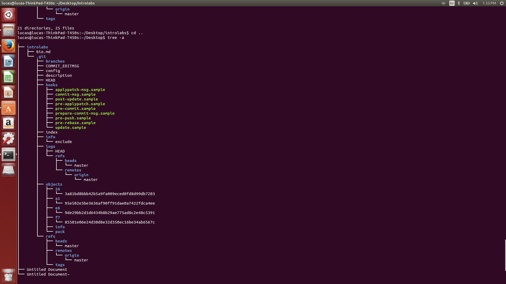

c: This chapter in Free Culture highlighted what seems to be an injustice to anyone that isen't part of the sueing party. Jesse was just a student that decided to upgrade and improve a system that was already implemented on the RPI campus. Because of relatively small modifications to this system, other people took advantage of this and pirated music. Since Jesse was the one to create the software and let the other students use it, the RIAA targeted him for their copyright claims, even though he had nothing to do with the pirate, just created the software that they were using. In the end, he had to settle with giving the RIAA 12,000 dollars and settle rather than fight that he was in the right.

Photo of Tree  

