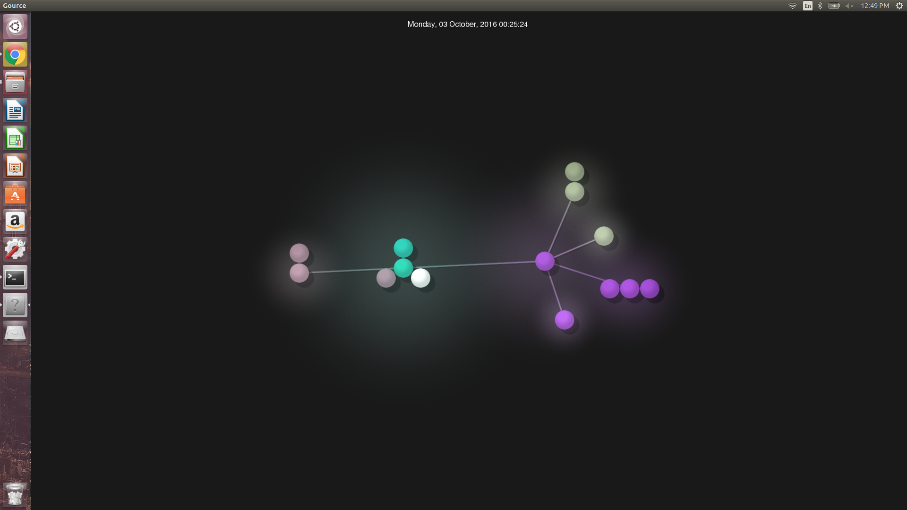
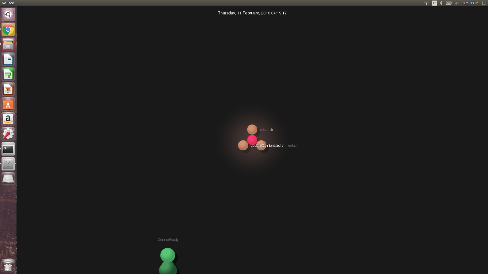
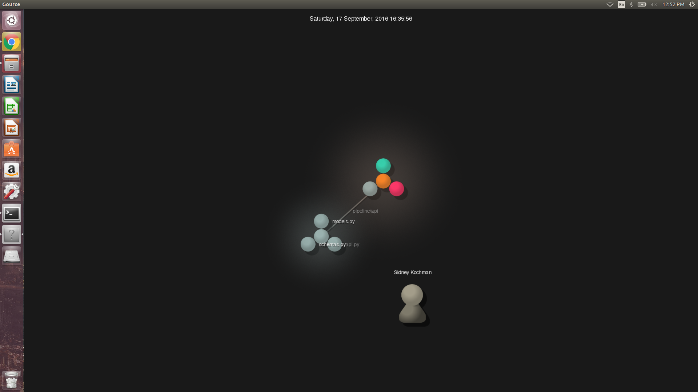
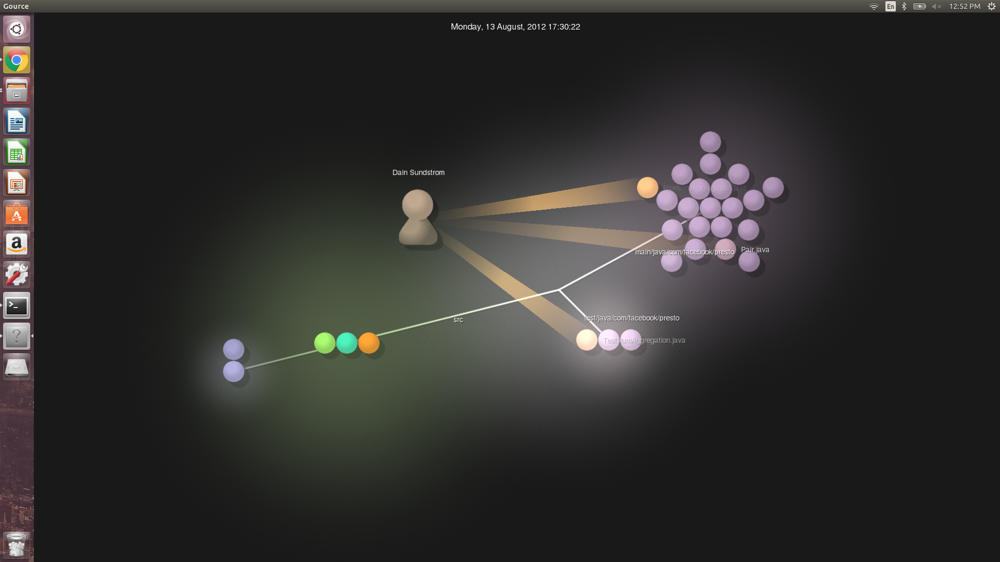
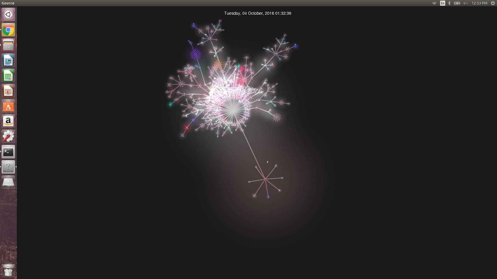

#Part 1
#1: Opinionated
*Number of Contriburtors: 4

*Number of Lines of Code: 172

*First Commit: Sep 30, 2015

*Latest Commit: May 2, 2016

*Current Branches:1 Master Branch

#2: Aegean Isle
*Number of Contriburtors: 2

*Number of Lines of Code: 1475

*First Commit: Sep 6, 2016

*Latest Commit: Oct 14, 2016

*Current Branches: Master Branch, Formatting branch

#3: Github Outlook Addin
*Number of Contriburtors: 1 

*Number of Lines of Code: 48389

*First Commit: Sep 8th, 2016

*Latest Commit: Oct 3rd, 2016

*Current Branches: 1 Branch, Master

#4: The Poly Pipeline
*Number of Contriburtors: 2

*Number of Lines of Code: 460

*First Commit: Sep 2nd, 2016

*Latest Commit: Oct 14th, 2016

*Current Branches: 1 Master Branch

#5: Presto
*Number of Contriburtors: 149

*Number of Lines of Code: 135631

*First Commit: Oct 1st, 2013

*Latest Commit: Oct 13th, 2016

*Current Branches: 1 master, Hotfix-0.152, Hotfix-0.144 

#Part 2
Screenshot 1: 

Screenshot 2: 

Screenshot 3: 

Screenshot 4: 

Screenshot 5: 

Changes made to Markdown.py

def convertHeader(line):
  line = re.sub(r'^\#\#\#(.*)$', r'<h3>\1</h3>', line)
  line = re.sub(r'^\#\#(.*)$', r'<h2>\1</h2>', line)
  line = re.sub(r'^\#(.*)$', r'<h1>\1</h1>', line)
  return line

def convertQuote(line):
  line = re.sub(r'^\>(.*)$', r'<blockquote>\1</blockquote>', line)
  return line

